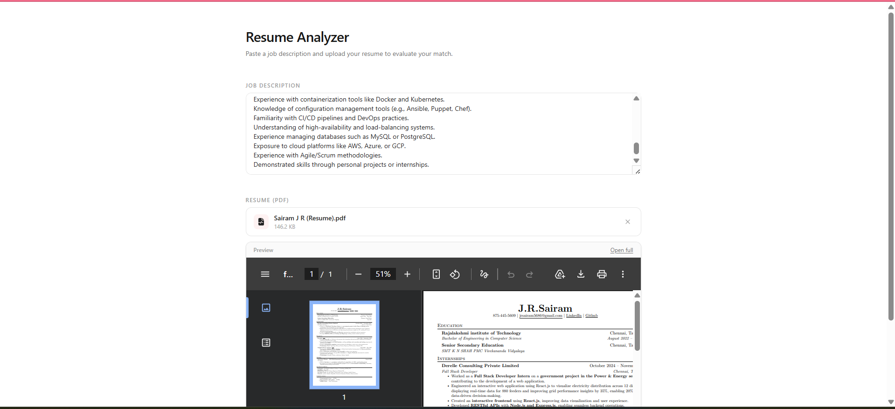
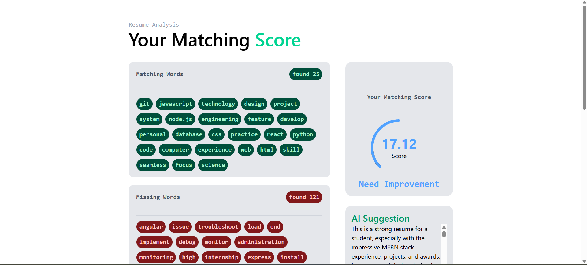
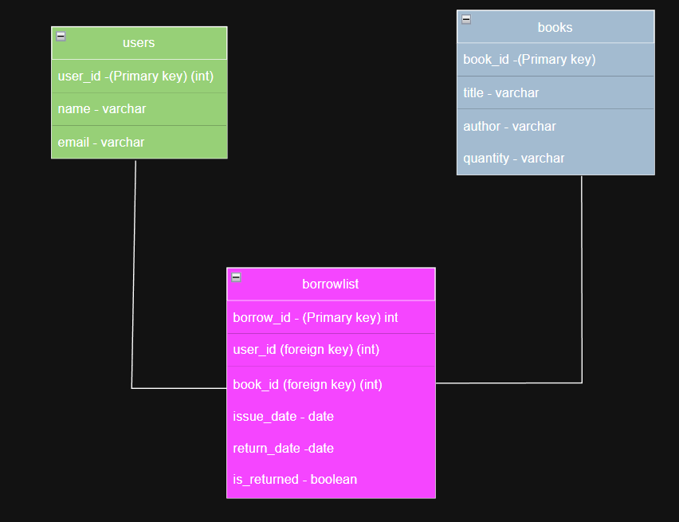

# Virtusa Use Case Assignments (Python , Java & SQL)


## Python Project
**Problem Statement**

Resume Analyzer &amp; Job Matcher
<br/>

Fresh graduates often struggle to tailor resumes for job roles. 

Build a Python tool that analyzes resumes and matches
them with suitable job descriptions.
Objectives
<br/>
*● Extract key information from resumes*
<br/>
*● Compare skills with job requirements*
<br/>
*● Provide a match score and suggestions*
<br/>

**Key Features**
<br/>
**● Upload/read resume (PDF or text)**
<br/>

**● Keyword extraction using NLP (e.g., nltk or spaCy)**
<br/>

**● Match resume skills with job description**
<br/>

**● Score the resume (e.g., 75% match)**
<br/>

**● Suggest missing skills**
<br/>

*Expected Outcome*
<br/>

```A smart assistant that helps users improve resumes and increases chances of getting shortlisted.
```
-------
**SOLUTION**
---
> [KEY FEATURES]
> - Upload Resume (PDF/Text)
> - Paste Job Description
> - Keyword Extraction using NLP 
> - AI-based Suggestions 
> - Match Score Calculation
> - Missing Skills Recommendation
> - Web Interface (React)

---
> [ TECHNOLOGY USED ]
> - **Python**  - Programming Language 
> - **Fast api** - Backend 
> - **React** - Frontend
> - **Gemini LLM** - For Ai suggesstions
> - **Spacy** - NLP
> - **pyPDF** - Text extraction from pdf 

--- 
## How to Run the Project 

### For Backend
note before running fill your own gemini api key

```
 cd Python_Project_Resume_Analyzer_and_Job_Matcher\Backend
 python -m uvicorn main:app --reload
```

### For Frontend
```
cd Python_Project_Resume_Analyzer_and_Job_Matcher\Frontend
npm install 
npm run dev 

```

## Screen Shots 

<div> 


</div>


## JAVA Project
**Problem Statement**<br/>

Library Management System
 Libraries often face difficulty managing book inventory and issuing records manually. Develop a Java-based system
to automate library operations.
<br/>
Objectives
- Manage books, users, and transactions
- Track issued and returned books
Key Features
- Add/remove/update books
- User registration system
- Issue and return books with due dates
- Fine calculation for late returns
- Search functionality (by title, author)
<br/>

Technology Suggestions
- Core Java (OOP concepts)
- Optional: JDBC + MySQL for database integration
- Simple console or GUI (Swing/JavaFX)
<br/>
Expected Outcome
A functional system that reduces manual effort and improves tracking efficiency.
---


## Solution
Make a Java + JDBC -based console application with the following features: 

- Manage users, books, and borrowing operations  
- Connect with a relational database using JDBC  
- Provide a menu-driven interface for easy interaction  
- Perform CRUD operations on users and books  
- Track borrowing and returning of books  
- Maintain data consistency using structured tables (`users`, `books`, `borrowlist`)  

---

## User Management Features
- Register User
  - Add a new user with name and email  
- Remove User
  - Delete a user using `user_id`  
- View Users
  - Display all registered users  

---

## Book Management Features
- Add Book
  - Add a new book with:
    - Book name  
    - Author name  
    - Quantity  
- Remove Book
  - Delete a book using `book_id`  
- View All Books
  - Display all available books in the library  
- Search Books
  - Search books using:
    - Author name  
    - Book title  

---

## Borrow & Return Features
- Borrow Book
  - User borrows a book using:
    - `user_id`  
    - `book_id`  
- Return Book
  - Return a borrowed book using:
    - `borrow_id`  
    - Return date (YYYY-MM-DD)  

- View Borrow List
  - Display all the borrowed / returned history

---

## Database Details
- Uses JDBC (Java Database Connectivity)  
-DB - Mysql
- Connected to:
  - Database: `lms`  
  - Tables:
    - `users`
    - `books`
    - `borrowlist`  

---


## Classes Used
- Uses separate classes:
  - `User` → handles user operations  
  - `Books` → handles book operations  
  - `BorrowBooks` → handles borrow/return logic  


---

## How to Run
```
cd Java_Project_Library_Management_System\Library_Management_System
javac -cp "lib/mysql-connector-j-9.6.0.jar" src/*.java
java -cp "lib/mysql-connector-j-9.6.0.jar;src" App
```
## DB Structure for Libary management system



## SQL Project
Problem Statement: Online Retail Sales Analysis Database
Retail businesses generate huge sales data but lack structured insights. Design a database and write SQL queries to
analyze sales performance.
<br />
**Objectives**
- Create a relational database for an online store
- Store customer, product, and order data
- Extract meaningful insights using SQL queries
Database Tables
- Customers (customer_id, name, city)
- Products (product_id, name, category, price)
- Orders (order_id, customer_id, date)
- Order_Items (order_id, product_id, quantity)

**Key Tasks**

- Find top-selling products
- Identify most valuable customers
- Monthly revenue calculation
- Category-wise sales analysis
- Detect inactive customers

Expected Outcome

A structured database with optimized queries that provide actionable business insights.


